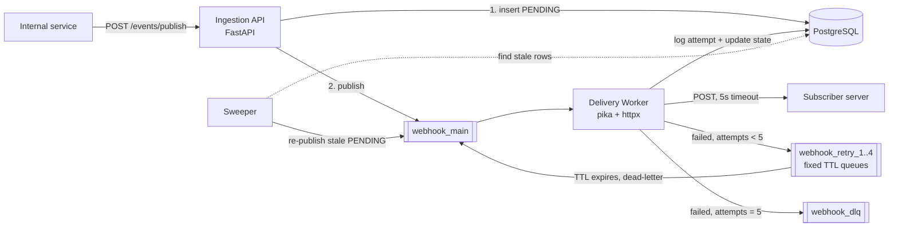

# Webhook Dispatcher

A fault-tolerant webhook delivery service built with **FastAPI, RabbitMQ, PostgreSQL, and httpx**.

Subscriber servers fail, time out, and return 5xx errors. This service makes sure a temporary outage on the subscriber's side never becomes permanent data loss on ours.

**Guarantees**

1. **At-least-once delivery.** State is persisted before anything is queued, and a message is acknowledged only after its outcome is recorded.
2. **Exponential backoff.** Failed deliveries are retried after 2s, 4s, 8s, 16s so a struggling server isn't hammered.
3. **Dead-lettering.** After 5 failed attempts a delivery is marked `FAILED` and moved to `webhook_dlq`, so it never blocks the main queue and can be inspected or replayed.

## Architecture



**Postgres is the source of truth for state; RabbitMQ is only the transport.** If anything crashes, the database still knows what happened and RabbitMQ redelivers unacknowledged messages.

### Lifecycle of one event

1. `POST /events/publish` inserts a `webhooks` row and a `PENDING` `deliveries` row, publishes `{delivery_id}` to RabbitMQ, and returns `202 Accepted` with a tracking ID.
2. A worker consumes the message, loads the delivery from Postgres, and POSTs the payload to the subscriber with a 5-second timeout.
3. On a 2xx response the delivery becomes `DELIVERED`.
4. On a non-2xx response, timeout, or connection error, the attempt is logged and the state becomes `RETRY`. The message goes to `webhook_retry_N`, a queue with a fixed TTL of `2^N` seconds, and when the TTL expires RabbitMQ dead-letters it back to `webhook_main`.
5. After 5 failed attempts the state becomes `FAILED` and the message is routed to `webhook_dlq`.

### Data model

| Table | Purpose |
|---|---|
| `webhooks` | Immutable: subscriber URL and JSONB payload |
| `deliveries` | State machine: `status` (`PENDING`, `DELIVERED`, `RETRY`, `FAILED`), `attempt_count`, `next_attempt_at` |
| `delivery_attempts` | Append-only log: one row per HTTP attempt (status code, error, duration) |

## Design decisions and tradeoffs

- **Ack last.** Order in the worker is: record outcome in Postgres, route the message (retry queue or DLQ), then ack. A crash at any point before the ack causes redelivery rather than loss.
- **At-least-once means duplicates are possible.** If a worker crashes after a successful POST but before recording it, the event is sent again. Every request carries an `X-Delivery-Id` header (and `X-Attempt`) so subscribers can deduplicate. Already-`DELIVERED` or `FAILED` deliveries are skipped if a duplicate message arrives.
- **Dual-write gap and the sweeper.** The API commits to Postgres and then publishes to RabbitMQ. If it dies between the two, a `PENDING` row exists with no message. A sweeper process re-publishes `PENDING` rows older than 60s. It claims rows with `UPDATE ... WHERE id IN (SELECT ... FOR UPDATE SKIP LOCKED) RETURNING id`, so multiple sweepers can run safely.
- **One retry queue per delay level.** RabbitMQ only expires per-message TTLs at the head of a queue, so mixing different delays in one queue causes head-of-line blocking. Separate queues with a fixed queue-level TTL avoid this, and need no plugin.
- **Publisher confirms, persistent messages, durable queues, `mandatory=True`.** A published message is confirmed by the broker, survives a broker restart, and an unroutable message raises an error instead of vanishing.
- **No database transaction is held open during the HTTP call**, so slow subscribers can't exhaust the connection pool.
- **Any non-2xx response is retried.** Simple and matches common webhook providers; a stricter design would treat most 4xx as permanent failures.
- **`prefetch_count=1`.** Each worker handles one message at a time; scale by running more workers.

## Run it

Requirements: Docker, Python 3.10+.

```bash
docker compose up -d                      # Postgres + RabbitMQ (UI: http://localhost:15672, guest/guest)
python -m venv .venv && source .venv/bin/activate    # Windows: .venv\Scripts\activate
pip install -r requirements.txt
```

Start each in its own terminal:

```bash
uvicorn app.main:app --port 8000          # ingestion API
uvicorn client:app --port 9000            # flaky mock subscriber (50% 503s; FAIL_RATE=1.0 to always fail)
python -m app.worker                      # delivery worker (run several to scale)
python -m app.sweeper                     # re-publishes stuck PENDING rows
```

Publish an event and check its status:

```bash
curl -X POST localhost:8000/events/publish \
  -H "Content-Type: application/json" \
  -d '{"subscriber_url": "http://localhost:9000/receive", "payload": {"order_id": 42}}'

curl localhost:8000/events/<tracking_id>      # status + full attempt history
```

## Load test: 1,000 events against a 50%-failure endpoint

```bash
python scripts/reset.py                   # clean tables and queues
python scripts/fire_events.py -n 1000
python scripts/verify.py                  # reconciles Postgres, RabbitMQ and the mock client
```

The test was run twice on a single local machine (everything in Docker or local processes), once with 1 worker and once with 3 workers (`python -m app.worker` in three terminals).

| Metric | 1 worker | 3 workers |
|---|---|---|
| Delivered (`DELIVERED`) | 962 | 979 |
| Dead-lettered (all found in `webhook_dlq`) | 38 | 21 |
| Stuck / lost | 0 | 0 |
| Total HTTP attempts | 2,012 | 1,918 |
| Duplicate deliveries | 0 | 0 |
| Latency p50 | 26.5s | 9.0s |
| Latency p95 | 59.1s | 27.7s |
| Latency p99 | 75.0s | 44.2s |

Going from 1 to 3 workers cut p50 latency about 3x and p95 about 2x. The tail improves less because it is largely set by the backoff schedule: a delivery that needs 5 attempts waits at least 2+4+8+16 = 30s by design. Latency here is therefore backoff delay plus queueing behind the workers, not the cost of a single delivery.

The delivered/dead-lettered split varies between runs because failures are random. A delivery is dead-lettered only if all 5 attempts fail, so the expected rate is 0.5^5, about 3.1%.

`verify.py` matches each `FAILED` row's ID against the actual messages in `webhook_dlq`, so it confirms the payloads are recoverable, not just that the counts match. It also compares the mock client's count of `200` responses to the `DELIVERED` rows to confirm there were no duplicate deliveries.
## Project layout

```
app/
  main.py        ingestion API (POST /events/publish, GET /events/{id})
  worker.py      delivery worker: HTTP attempt, state transitions, retry/DLQ routing
  sweeper.py     re-publishes stale PENDING deliveries
  topology.py    exchanges, queues, backoff formula (shared by API and worker)
  broker.py      RabbitMQ publisher (thread-local connections, confirms)
  db.py, config.py
client.py        flaky mock subscriber
db/schema.sql    Postgres schema
scripts/         fire_events.py, verify.py, reset.py
```

## Limitations and future work

- No authentication, per-subscriber rate limiting, or circuit breaker.
- Outgoing payloads are not signed (an HMAC signature header, as Stripe does, would let subscribers verify authenticity).
- DLQ replay is manual; there is no replay endpoint yet.
- `httpx` timeouts apply per phase (connect/read/write), not as one hard total deadline.
- Only `PENDING` rows are swept; the retry path relies on RabbitMQ redelivery.
- No automated test suite; verification is the end-to-end `verify.py` reconciliation.


"Built as a learning project to explore reliable messaging patterns"
